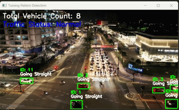

# **Predicting Turning Patterns and Vehicle Count Using Camera Feeds** 🚦🚗

## **📌 Overview**

This project utilizes **YOLOv8 (Ultralytics) and DeepSORT** to detect and track vehicles from **live camera feeds or recorded videos**. It predicts **vehicle turning patterns (Left, Right, Straight)** and provides **real-time traffic insights** through a web dashboard built with **Flask**.

<!-- 
---

## **🎥 Demo Video**
<p align="center">
    <a href="https://www.youtube.com/watch?v=your_video_id">
        
    </a>
</p>


---
 -->

## **🎯 Features**

✅ **Real-time Vehicle Detection** using YOLOv8\  
✅ **Object Tracking** with DeepSORT\  
✅ **Turning Pattern Classification** (Left, Right, Straight)\  
✅ **Traffic Status Estimation** (Normal or Heavy Traffic)\  
✅ **Data Storage in SQLite Database (`vehicles.db`)**\  
✅ **Web Dashboard** to visualize traffic statistics

---

## **📂 Project Structure**

```
Predicting turning pattern and vehicle count using camera feeds/
│── my_virtual_env/         # Virtual environment  
│── static/                 # Contains CSS for UI and media files  
│   ├── images/             # Images & GIFs  
│   │   ├── yolo_detection.gif  
│   │   ├── demo_thumbnail.jpg  
│   ├── videos/             # Sample videos  
│   │   ├── intersection2.mp4  
│   ├── style.css  
│── templates/              # HTML templates for Flask  
│   ├── index.html  
│── app.py                  # Flask backend for the web dashboard  
│── test.py                 # Runs object detection & tracking  
│── requirements.txt        # List of dependencies  
│── vehicles.db             # SQLite database storing vehicle counts  
│── coco.txt                # Class labels for YOLOv8  
│── yolov8s.pt              # Pre-trained YOLOv8 model  
```

---

## **🚀 How to Run**

### **1️⃣ Set up a virtual environment:**

```sh
python -m venv my_virtual_env
my_virtual_env\Scripts\activate  # (Windows)
source my_virtual_env/bin/activate  # (Mac/Linux)
```

### **2️⃣ Install dependencies:**

```sh
pip install -r requirements.txt
```

### **3️⃣ Run object detection & tracking:**

```sh
python test.py
```

### **4️⃣ Start the Flask web dashboard:**

```sh
python app.py
```

### **5️⃣ View real-time traffic insights at:**

```
http://127.0.0.1:5003/
```

---

## **📊 Traffic Analysis**

### **Detection & Tracking in Action**

<p align="center">
    
    
</p>

---

## **🔧 Technologies Used**

- **Python**
- **Flask** (Web dashboard)
- **OpenCV (cv2)** (Video processing)
- **YOLOv8 (Ultralytics)** (Object detection)
- **DeepSORT** (Object tracking)
- **SQLite** (Database storage)

---

## **📌 Future Enhancements**

- 🚀 Add **real-time speed estimation** for vehicles
- 📡 Support for **live CCTV feeds**
- 📊 Improve traffic analysis with **machine learning models**

---

## **🌟 Contributions & Feedback**

Feel free to fork, modify, or suggest improvements!\  
💬 **Have an idea? Open an issue!**

