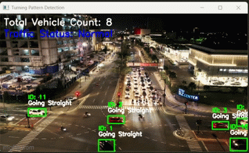

# Predicting Turning Patterns and Vehicle Count Using Camera Feeds 🚦🚗

<p align="center">
  
  
  
  
  
  
</p>

<p align="center">
  <strong>Real-time computer vision system for vehicle detection, tracking, counting, and turning-pattern analysis.</strong>
</p>

---

## 📌 Overview

**Predicting Turning Patterns and Vehicle Count Using Camera Feeds** is a computer vision-based traffic monitoring system that analyzes traffic camera footage to detect and track vehicles, count individual vehicles, and classify their movement as:

- ↩️ Left
- ↪️ Right
- ⬆️ Straight

The system combines **YOLOv8**, **DeepSORT**, **OpenCV**, **Flask**, and **SQLite** to process traffic video and present the resulting information through a web dashboard.

It can work with recorded traffic videos and can be extended to support live camera or CCTV/IP streams.

---

## ✨ Features

| Feature | Description |
|---|---|
| 🚗 Vehicle Detection | Detects vehicles using YOLOv8 |
| 🎯 Object Tracking | Tracks vehicles across frames using DeepSORT |
| ↩️ Turning Classification | Identifies Left, Right, and Straight movement |
| 🔢 Vehicle Counting | Counts tracked vehicles while reducing duplicate counting |
| 🆔 Tracking IDs | Maintains unique IDs for tracked vehicles |
| 🚦 Traffic Status | Estimates traffic as Normal or Heavy |
| 💾 Data Storage | Stores traffic information using SQLite |
| 🌐 Web Dashboard | Displays traffic statistics through Flask |
| 🎥 Video Processing | Processes recorded traffic footage using OpenCV |
| 📊 Traffic Analysis | Aggregates vehicle and movement information |

---

## 🧠 System Architecture

```text
┌─────────────────────────┐
│   Camera Feed / Video   │
└────────────┬────────────┘
             │
             ▼
┌─────────────────────────┐
│     YOLOv8 Detection    │
│     Vehicle Detection   │
└────────────┬────────────┘
             │
             ▼
┌─────────────────────────┐
│    DeepSORT Tracking    │
│     Unique Track IDs    │
└────────────┬────────────┘
             │
             ▼
┌─────────────────────────┐
│   Movement Trajectory   │
│       Analysis          │
└────────────┬────────────┘
             │
       ┌─────┼─────┐
       ▼     ▼     ▼
     LEFT  RIGHT  STRAIGHT
       │     │     │
       └─────┼─────┘
             │
             ▼
┌─────────────────────────┐
│ Vehicle Count & Traffic │
│       Analysis           │
└────────────┬────────────┘
             │
             ▼
┌─────────────────────────┐
│     SQLite Database     │
└────────────┬────────────┘
             │
             ▼
┌─────────────────────────┐
│    Flask Web Dashboard  │
└─────────────────────────┘
```

---

## 🔍 How It Works

### 1. Vehicle Detection

YOLOv8 processes each video frame and identifies supported vehicle classes such as:

- Cars
- Motorcycles
- Buses
- Trucks

Bounding boxes are generated for detected objects.

### 2. Vehicle Tracking

DeepSORT associates detections across consecutive frames and assigns unique tracking IDs.

This allows the system to follow the same vehicle through the intersection instead of treating every frame detection as a new vehicle.

### 3. Movement Analysis

The tracked vehicle positions are analyzed over time.

Based on the movement trajectory, the system classifies vehicles into:

```text
        LEFT
          ↖
           \
            \
             ● ─────────→ STRAIGHT
            /
           /
          ↘
        RIGHT
```

### 4. Vehicle Counting

Tracking IDs are used to avoid counting the same tracked vehicle repeatedly.

### 5. Traffic Analysis

The collected vehicle information is used to calculate traffic statistics and estimate the current traffic condition.

### 6. Dashboard

The processed information is stored in SQLite and displayed through a Flask-based web dashboard.

---

## 📊 Traffic Metrics

The system records information such as:

| Metric | Description |
|---|---|
| 🚗 Vehicle Count | Number of tracked vehicles |
| ↩️ Left Turns | Vehicles classified as left-turning |
| ↪️ Right Turns | Vehicles classified as right-turning |
| ⬆️ Straight | Vehicles continuing straight |
| 🚦 Traffic Status | Current estimated traffic condition |
| 🕒 Timestamp | Time associated with recorded traffic data |

---

## 🎥 Detection & Tracking

<p align="center">
  
</p>

<p align="center">
  
  
</p>

---

## 🛠️ Technology Stack

| Category | Technology | Purpose |
|---|---|---|
| Programming Language | Python 3.10 | Core application and computer vision logic |
| Object Detection | YOLOv8 | Vehicle detection |
| Object Tracking | DeepSORT | Multi-object tracking |
| Computer Vision | OpenCV | Video and frame processing |
| Web Framework | Flask 2.2 | Traffic monitoring dashboard |
| Database | SQLite | Traffic data storage |
| Data Processing | NumPy / Pandas | Data processing and analysis |
| Frontend | HTML / CSS / JavaScript | Dashboard interface |

---

## 📂 Project Structure

```text
Predicting-Turning-Pattern-and-Vehicle-Count-Using-Camera-Feeds/
│
├── static/
│   ├── images/
│   │   ├── yolo_detection.gif
│   │   ├── rec1.gif
│   │   ├── rec2.gif
│   │   └── demo_thumbnail.jpg
│   │
│   ├── videos/
│   │   └── intersection2.mp4
│   │
│   └── style.css
│
├── templates/
│   └── index.html
│
├── app.py
├── test.py
├── requirements.txt
├── vehicles.db
├── coco.txt
├── yolov8s.pt
├── LICENSE.md
└── README.md
```

> `my_virtual_env/` is intentionally excluded from the repository structure because virtual environments should normally be created locally rather than committed to Git.

---

## 🚀 Getting Started

### Prerequisites

Make sure the following are installed:

- Python 3.10
- pip
- Git
- A compatible traffic video or camera source
- Sufficient hardware resources for YOLOv8 inference

---

## 🔧 Installation

### 1. Clone the Repository

```bash
git clone https://github.com/YashPalkandwar1908/Predicting-Turning-Pattern-and-Vehicle-Count-Using-Camera-Feeds.git

cd Predicting-Turning-Pattern-and-Vehicle-Count-Using-Camera-Feeds
```

### 2. Create a Virtual Environment

#### Windows

```powershell
python -m venv my_virtual_env

.\my_virtual_env\Scripts\Activate.ps1
```

If PowerShell execution policy prevents activation, you can also run:

```powershell
my_virtual_env\Scripts\activate
```

#### macOS / Linux

```bash
python3 -m venv my_virtual_env
source my_virtual_env/bin/activate
```

### 3. Install Dependencies

```bash
pip install -r requirements.txt
```

---

## ▶️ Running the Project

### Start Vehicle Detection and Tracking

```bash
python test.py
```

This starts the computer vision pipeline for vehicle detection, tracking, counting, and movement analysis.

### Start the Flask Dashboard

Open another terminal and run:

```bash
python app.py
```

The dashboard runs locally at:

```text
http://127.0.0.1:5003/
```

---

## 🖥️ Dashboard

The Flask dashboard provides a simple interface for viewing processed traffic information.

The dashboard can be used to display:

- Total vehicle count
- Left-turn count
- Right-turn count
- Straight-moving vehicle count
- Traffic status
- Stored traffic information

---

## 📈 Example Processing Pipeline

```text
Traffic Camera
      │
      ▼
Video Frame
      │
      ▼
YOLOv8
      │
      ▼
Vehicle Detection
      │
      ▼
DeepSORT
      │
      ▼
Unique Vehicle ID
      │
      ▼
Trajectory Tracking
      │
      ├─────────────┬─────────────┐
      ▼             ▼             ▼
    Left          Right        Straight
      │             │             │
      └─────────────┼─────────────┘
                    ▼
             Vehicle Statistics
                    │
                    ▼
              SQLite Database
                    │
                    ▼
             Flask Dashboard
```

---

## 🔮 Future Enhancements

The project can be extended with:

- 🚀 Real-time vehicle speed estimation
- 📡 Live CCTV/IP camera support
- 🤖 Machine-learning-based traffic forecasting
- 🚦 Traffic signal optimization
- 📍 Multi-intersection monitoring
- 📊 Historical traffic analytics
- ☁️ Cloud deployment
- 📱 Mobile-friendly dashboard
- 🚘 Vehicle-type-specific analytics
- 🧠 Improved trajectory and turning classification
- 🔥 Traffic-density heatmaps
- 📈 Time-based traffic trend analysis

---

## ⚠️ Current Limitations

The current implementation is primarily a prototype/educational traffic-analysis system.

Performance can vary depending on:

- Camera angle
- Video resolution
- Lighting conditions
- Vehicle occlusion
- Traffic density
- Camera movement
- Detection quality
- Tracking stability
- Intersection geometry

Turning classification is based on tracked vehicle movement and therefore depends on the quality and consistency of the trajectory data.

---

## 🤝 Contributions

Contributions, suggestions, and improvements are welcome.

To contribute:

1. Fork the repository.
2. Create a feature branch.
3. Make your changes.
4. Test the implementation.
5. Commit your changes.
6. Push the branch.
7. Open a Pull Request.

---

## ⭐ Acknowledgements

This project uses and builds upon several open-source technologies, including:

- Ultralytics YOLOv8
- DeepSORT
- OpenCV
- Flask
- SQLite
- NumPy
- Pandas

Please refer to the respective projects for their licensing and usage terms.

---

<p align="center">
  Built with Python, Computer Vision & AI 🚦
</p>
